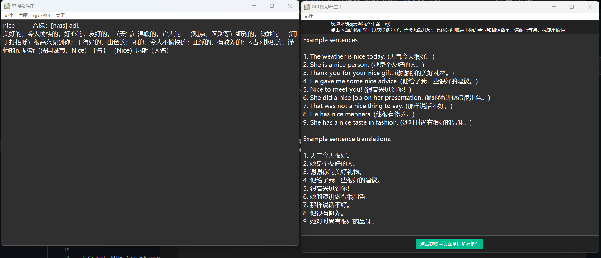
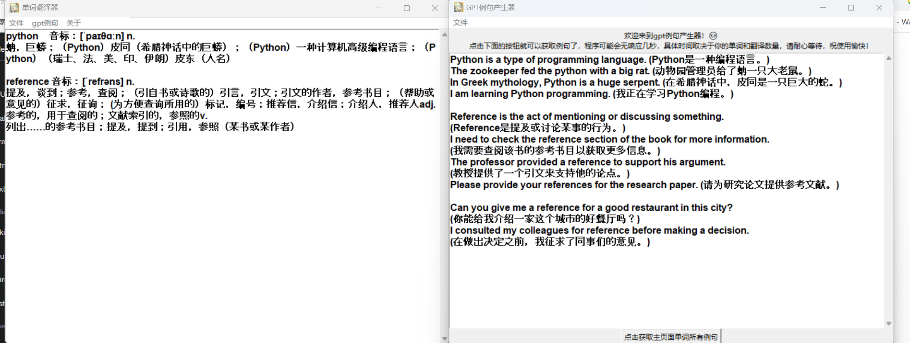

# LearnEnglishWithSentences

<div align="center">
欢迎使用本项目喵~😊

</div>


## 创建.env文件

用编辑器打开编辑，填入你的接口和apikey
```env
youdao_appKey = ""
youdao_appSecret = ""

openai_baseurl = "https://oa.api2d.net/v1/chat/completions"
openai_apiKey = ""
```

> 上面用的是api2d的接口，应该是和openai官方的是一样的
> 查词用的是有道api,`http://fanyi.youdao.com/openapi/ `来这儿来取密钥，注册好像送100体验金

## 直接使用

点击里面的run.cmd就行了

## 隔离使用

首先要安装包

```batch
pip install -r requirements
```

下载压缩包，然后解压，打开文件夹，右键打开终端，运行

```batch
python main.py
```

就能看到这个页面了，点击关于查看帮助

